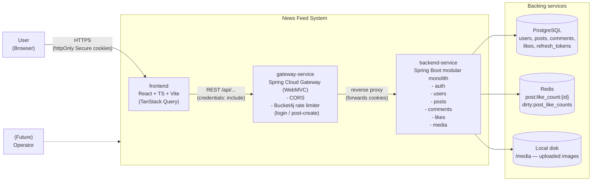
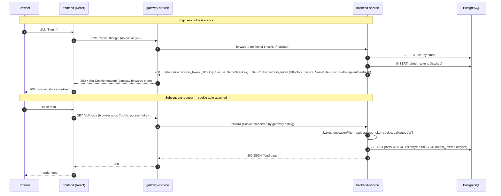
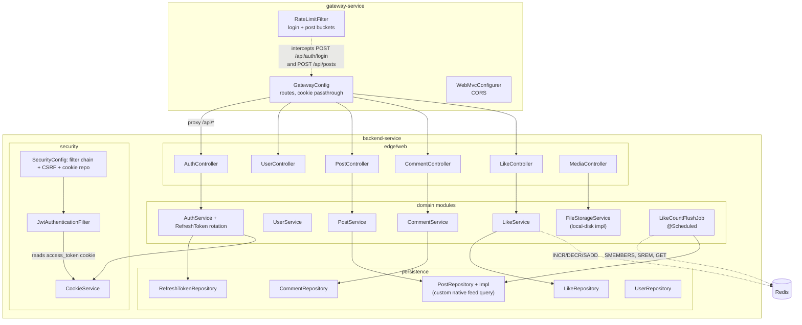
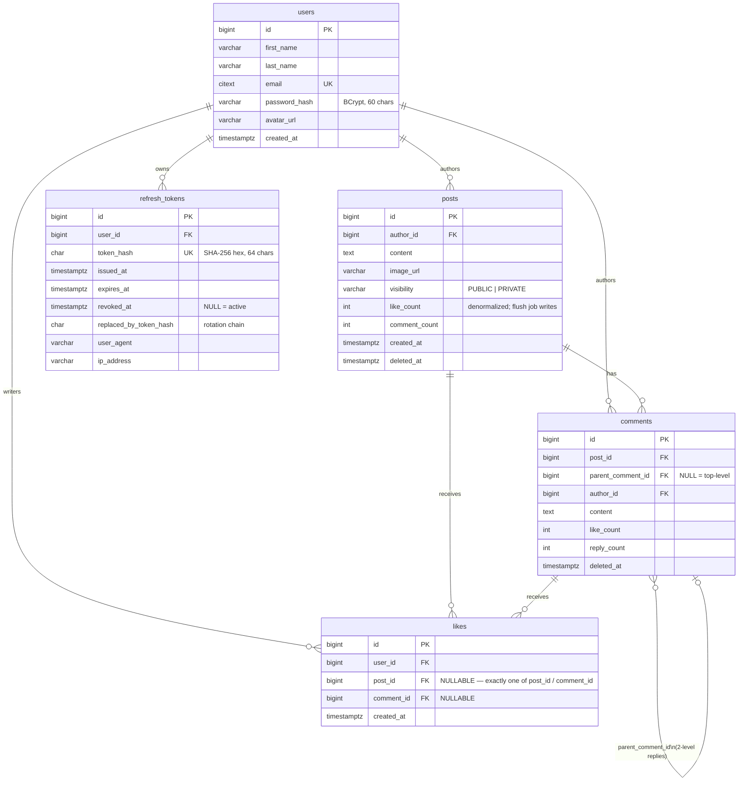
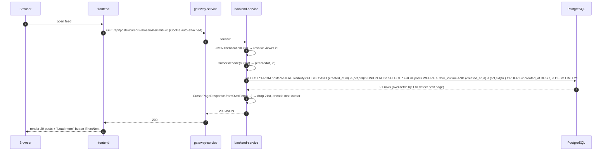
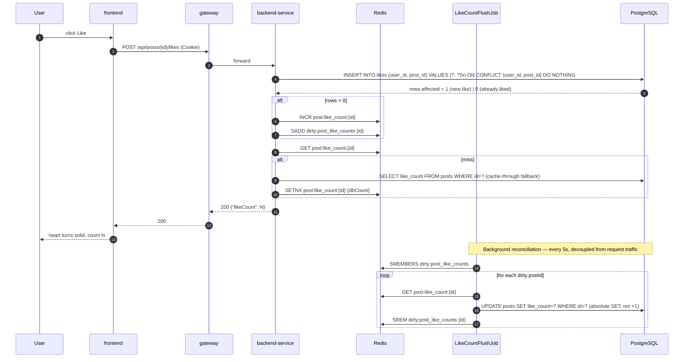
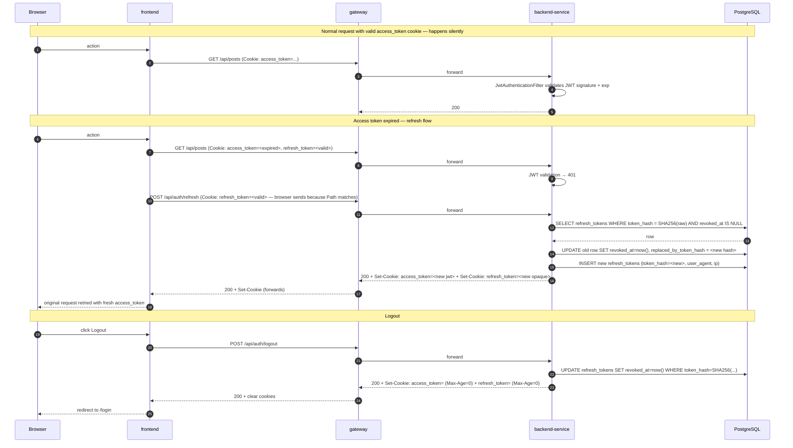
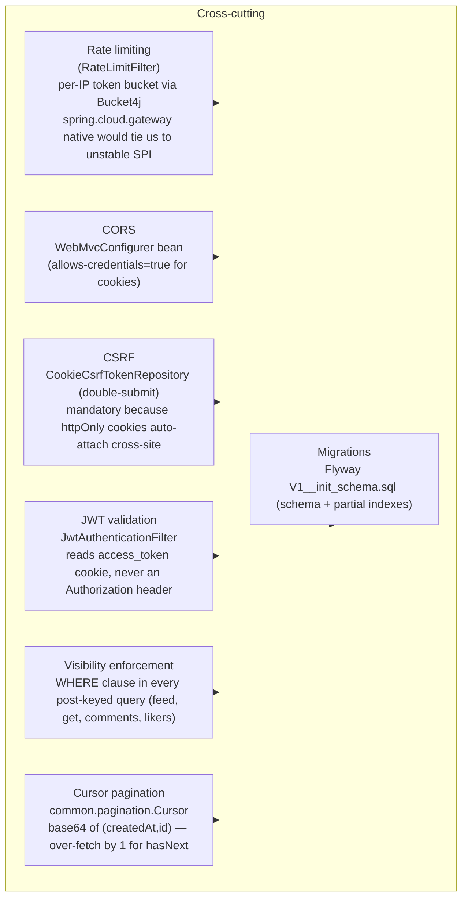
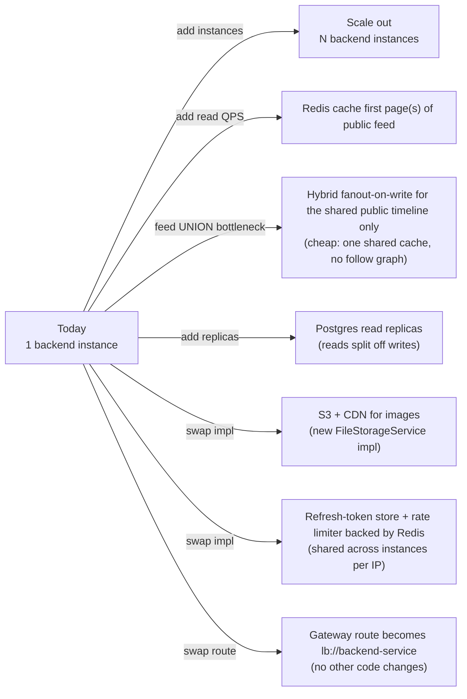

# High-Level Design — News Feed System

A small social news-feed app: register/login, a global feed of public posts (plus your own private ones), text+image posting, likes with "who liked" lists, and two-level comments/replies with their own likes.

## 1. System Context (deployables + external users)

### Three deployables

| Deployable | Tech | Role |
|------------|------|------|
| `frontend` | React + TypeScript + Vite, TanStack Query | Mustache-style template + missing features (private toggle, "who liked" list). Holds no auth token in JS — the JWT lives in an httpOnly Secure cookie so XSS can't read it. |
| `gateway-service` | Spring Cloud Gateway (servlet/WebMVC flavor) | Single public entry point (replaces a load balancer when only one backend exists), CORS, and Bucket4j in-memory per-IP rate limiter on `POST /api/auth/login` and `POST /api/posts`. |
| `backend-service` | Spring Boot modular monolith | All business logic: `auth/`, `user/`, `post/`, `comment/`, `like/`, `media/`, plus `security/` (CookieService, JwtAuthenticationFilter, CSRF) and `common/` (cursor pagination). |

### Two backing services (one staged via docker-compose)

| Service | Used for | Source of truth? |
|---------|----------|------------------|
| **PostgreSQL** | `users`, `posts`, `comments`, `likes`, `refresh_tokens` | Yes — relational source of truth for everything except the live like counter |
| **Redis** | `post:like_count:{id}` STRING counter; `dirty:post_like_counts` SET | Live like count (eventually reconciled into `posts.like_count` by `LikeCountFlushJob` every 5s) |
| **Local disk** (`/media`) | Uploaded post images | Yes (today) — explicit limitation: doesn't survive >1 backend instance; `FileStorageService` interface lets you swap to S3+CDN later |

## 2. Request lifecycle (auth + JWT cookies)

### Key security choices
- **JWT lives in `httpOnly + Secure + SameSite=Lax` cookie**, never `localStorage`. Any JS (incl. XSS) cannot read it → token-theft-resistant.
- **Refresh token is opaque** (random bytes), SHA-256 **hashed** at rest in `refresh_tokens`, scoped to `Path=/api/auth/refresh`, `SameSite=Strict`, rotated on every refresh (replaced-by chain stored for replay detection).
- **CSRF** defense-in-depth is mandatory because the browser auto-attaches the cookie on cross-site requests. Handled by Spring Security's `CookieCsrfTokenRepository` double-submit pattern (`XSRF-TOKEN` cookie JS-readable, read by SPA and echoed back as `X-XSRF-TOKEN` header).
- **Logout** = `clearAuthCookies` (cookies with `Max-Age=0`) + revoke the refresh-token row → real server-side revocation, no Redis denylist needed for V1.

## 3. Backend modules (modular monolith boundary)

## 4. Data model (PostgreSQL)

### Schema design choices
- **One `comments` table** for both top-level comments and replies (self-referencing `parent_comment_id`, capped at 2 levels) — avoids duplicate near-identical code paths; reply endpoints mirror comment endpoints.
- **One `likes` table** for both posts and comments — `CHECK ((post_id IS NOT NULL)::int + (comment_id IS NOT NULL)::int = 1)` enforces exactly one target. Partial unique indexes `uq_likes_user_post` / `uq_likes_user_comment` make duplicate-likes physically impossible at the DB layer.
- **No friend/follow graph** — visibility is a single `PUBLIC`/`PRIVATE` flag on `posts`. Every user sees every public post; users see their own private posts. Eliminates the fanout-on-write worker, graph DB, and hot-key problems from the ByteByteGo reference design.
- **Partial indexes everywhere** they ship predicate-shaped scans:
  - `idx_posts_public_feed` on `(created_at DESC, id DESC) WHERE visibility='PUBLIC' AND deleted_at IS NULL`
  - `idx_posts_author_feed` on `(author_id, created_at DESC, id DESC) WHERE deleted_at IS NULL`
  
  The feed query is a **`UNION ALL` of these two branches** — a single composite index can't serve an OR'd visibility predicate as a bounded ordered scan.

## 5. Feed read path (keyset pagination everywhere)

- **Keyset not offset** — `WHERE (created_at, id) < (:cursor_created_at, :cursor_id)` keeps the scan bounded as the table grows; the spec calls out "millions of posts and reads" and offset pagination degrades to skipping N rows.
- **Over-fetch by 1** (`limit+1`) is how `hasNext` is computed — no separate count query.
- **Visibility is enforced only in SQL `WHERE` clauses**, never as a post-fetch application filter. Every comment/like sub-resource endpoint keyed by `postId` re-checks that post's visibility — otherwise guessing a private post's ID would leak its comments/likers.

## 6. Like write path (write-behind cache)

Design rationale — the **hot Postgres row is touched once per 5s per post, regardless of how many likes landed**. A viral post getting 10k likes in 5s costs one DB write, not 10k. Absolute `SET` (not `+1`) makes it crash-safe and idempotent: a mid-flush crash only leaves Postgres stale, never corrupted.

## 7. Auth & refresh-token rotation

Tokens are stored only as **SHA-256 hashes** in `refresh_tokens` — the raw value exists only transiently to be written into the Set-Cookie header, never persisted, never read back.

## 8. Cross-cutting concerns

## 9. Future scalability (documented in DOCUMENTATION.md, not built)

## Key design principles referenced by the diagrams
- **Fanout-on-read, no follow graph** — the entire feed is one `UNION ALL` query, not a precomputed per-user timeline.
- **Write-behind cache for like counts** — Redis counters per hot post; Postgres denormalized `like_count` reconciled every 5s by `LikeCountFlushJob` with absolute `SET`.
- **PostgreSQL over MongoDB** — relationship-dense domain (`users → posts → comments → likes`), real joins, real FK integrity.
- **JWT in httpOnly Secure cookies** (not `Authorization` header / `localStorage`) — XSS-resistant at the cost of mandatory CSRF defense.
- **Keyset pagination everywhere** — bounded scans as the tables grow to millions of rows.
- **Visibility enforced in SQL `WHERE` only**, never post-fetch — every `postId`-keyed endpoint re-checks.
- **Single `comments` table** (self-ref, 2 levels) and **single `likes` table** (CHECK exactly-one-target) — DRY for the only two shapes the spec needs.
- **Local-disk images behind `FileStorageService`** — the limitation (no multi-instance survival) is documented; swapping to S3+CDN is a new impl, not a caller rewrite.